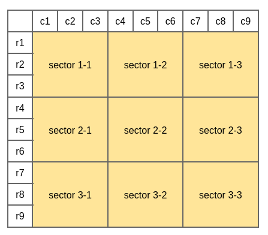

# **SUDOKU Validator**

Firstly, use the following to generate a jar file :

_mvn clean install_

You can use one of the following terminal commands depending on your host OS :

**on linux :** 

_sh validate.sh filename.csv_

**on windows :** 

_validate.bat filename.csv_

There are two sample files under the project :
**valid-sudoku.csv** and **invalid-sudoku.csv**

### Assumption did for input file : 

**Input file has 9 rows and each row has 9 value seperated by comma**

For column validation, we check columns c1,...,c9
For row validation, we check rows r1,...,r9
For sector validation, we check 3x3 submatrix, sector 1-1,...,sector 9-9

